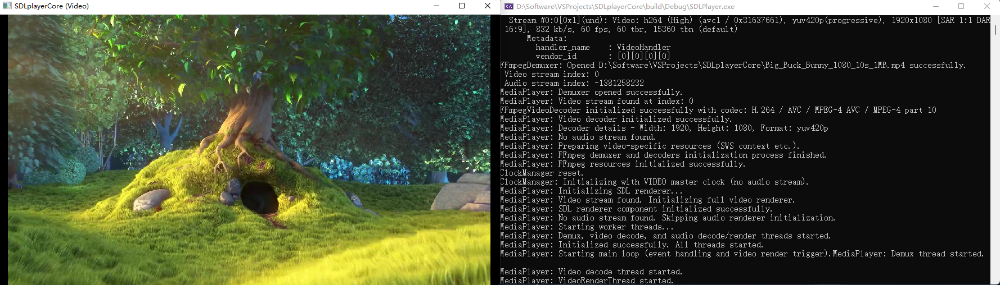
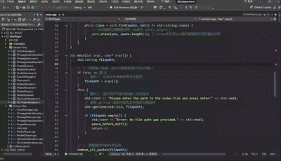

<p align="right">
  <a href="../README.md"><strong>简体中文</strong></a>
</p>

# SDLplayerCore

<p align="center">
  
  
  
  
  
</p>

**A C++ audio/video player core designed for learning and practice, helping you to deeply understand the multi-threaded application of FFmpeg and SDL.**



## Table of Contents

- [SDLplayerCore](#sdlplayercore)
  - [Table of Contents](#table-of-contents)
  - [Introduction](#introduction)
  - [Architecture Overview](#architecture-overview)
  - [Features](#features)
  - [Quick Start](#quick-start)
    - [Prerequisites](#prerequisites)
    - [Compilation and Building](#compilation-and-building)
    - [Project File Structure](#project-file-structure)
  - [How to Use](#how-to-use)
  - [Feedback](#feedback)
  - [Planned Features](#planned-features)
  - [License](#license)
  - [Acknowledgements](#acknowledgements)
    - [Core Dependencies](#core-dependencies)
    - [Learning and Reference Resources](#learning-and-reference-resources)
    - [Productivity Tools](#productivity-tools)


## Introduction

`SDLplayerCore` is a lightweight audio/video player developed with C++11, FFmpeg 7, and SDL2. It primarily targets the Windows platform and serves as an excellent project for hands-on practice in audio and video development.

Currently, the project implements:
- **Buffer queue** and **flow control** design in audio/video playback
- Core **audio/video synchronization**
- **Play/Pause** logic

Through this project, developers can learn:

- **FFmpeg 7 API**: How to use the `libavformat` library for demuxing and the `libavcodec` library for audio/video decoding.
- **SDL2 API**: How to create windows, render video frames (AVFrame -> YUV -> RGB), and handle audio PCM data.
- **Multithreaded Concurrent Programming**: How to manage data reading/demuxing, audio/video decoding, and rendering modules in separate, safe threads, and communicate between them using modern C++11 mutexes and condition variables.
- **Audio/Video Synchronization**: A basic yet effective A/V sync strategy based on `SDL_QueueAudio`.
- **CMake Build System**: How to configure a cross-platform-oriented project with external library dependencies.

**Live Demo:**

The following GIF demonstrates the player's functionality, including playing video and audio-only files, window resizing, and pause/resume capabilities.



## Architecture Overview

This project adopts a multi-threaded "producer-consumer" model, decoupling the playback process into five core threads. These threads exchange data through thread-safe buffer queues.

> For more detailed interaction logic, sequence diagrams, and design decisions, please refer to the
> [**Detailed Design Document - DESIGN.md**](../docs/DESIGN.md).


> **About the Diagrams**
> <details>
>   <summary>Click to view diagram source files and editing instructions</summary>
> 
>   The architecture and flowcharts in this project are created using [Mermaid](https://mermaid.js.org/) and [Draw.io](https://www.drawio.com/).
>   The illustrations displayed directly in the documentation are `.svg` image files. The corresponding source files (`.drawio` and some `mermaid` source code stored in `.md` format) are located in the `docs/assets/` directory.
>   If you need to make modifications, please prioritize editing the `mermaid` source code in the `.md` files, import it into the `.drawio` source file, adjust as needed, and then export it as an `.svg` image file. Update the corresponding file path in the documentation and commit all new files together.
> </details>

## Features

- [x] Supports playback of major video formats (e.g., MP4, AVI, FLV)
- [x] Supports playback of major audio formats (e.g., MP3, WAV, FLAC)
- [x] Audio-video synchronization
- [x] Video play, pause, and stop
- [x] Window resizing

## Quick Start

### Prerequisites

Before compiling and running the program, ensure your development environment meets the following requirements:

- **Operating System**: Windows 10/11 (64-bit)
- **IDE/Compiler**: Visual Studio 2022 (v17.9+) with the "Desktop development with C++" workload installed.
- **Build System**: CMake (3.15+)
- **Version Control**: Git

### Compilation and Building

1.  **Clone the project**
    ```bash
    git clone [https://github.com/Ko-vey/SDLplayerCore.git](https://github.com/Ko-vey/SDLplayerCore.git)
    cd SDLplayerCore
    ```

2.  **Install Dependencies**

    This project depends on FFmpeg 7 and SDL2. There are two ways to configure them:

    **Method 1: Use vcpkg**

    [vcpkg](https://learn.microsoft.com/en-us/vcpkg/) is an efficient C++ library manager that simplifies the dependency installation process.

    ```bash
    # (If not already installed) Install vcpkg...
    git clone [https://github.com/microsoft/vcpkg.git](https://github.com/microsoft/vcpkg.git)
    ./vcpkg/bootstrap-vcpkg.bat # or bootstrap-vcpkg.sh for other systems

    # Install dependencies for this project (e.g., for Windows x64)
    # Ensure they are FFmpeg 7 and SDL2 versions
    vcpkg install ffmpeg:x64-windows sdl2:x64-windows
    ```

    **Method 2: Manual Download and Configuration**

    If you prefer to manage dependencies manually, follow these steps.

    1.  **SDL2**

        - Download `SDL2-devel-2.32.2-VC.zip` (for Visual C++) from the [SDL2 official releases page](https://github.com/libsdl-org/SDL/releases/tag/release-2.32.2).
        - Create a `third_party/sdl2` folder in the project root and organize the extracted contents as follows:
          ```bash
          third_party/sdl2/
          ├── include/SDL2/  (contains all .h files)
          ├── lib/      (contains all .lib/.pdb files)
          └── bin/      (contains all .dll files)
          ```
    2.  **FFmpeg 7**
        - Download the shared version of the library (`libffmpeg_7.0_msvc17_x64.zip`) from the [Windows Builds recommended by FFmpeg's website](https://github.com/ShiftMediaProject/FFmpeg/releases/tag/7.0).
        - Create a `third_party/ffmpeg` folder in the project root and organize the extracted contents as follows:
          ```bash
          third_party/ffmpeg/
          ├── include/  (contains libav* headers)
          ├── lib/      (contains .lib files)
          └── bin/      (contains .dll files)
          ```
        > Note: When configuring manually, ensure the `find_package` paths in `CMakeLists.txt` match the directory structure.

    3.  **Build the Project**
        - **If using vcpkg:**
            ```bash
            # -DCMAKE_TOOLCHAIN_FILE points to vcpkg's toolchain file
            cmake -S . -B build -DCMAKE_TOOLCHAIN_FILE=[vcpkg_path]/scripts/build/systems/vcpkg.cmake

            # Compile
            cmake --build build
            ```

        - **If configuring dependencies manually:**        
            ```bash
            # In a terminal like Developer Command Prompt for VS 2022
            # From the project root directory
            cmake -S . -B build
            # Compile
            cmake --build build
            ```
    After the build is complete, the executable will be located in the `build/` Release directory. You can also open `build/SDLplayerCore.sln` with Visual Studio to compile and debug.

### Project File Structure

After completing the basic setup, the project file structure will look roughly like this:

```bash
SDLplayerCore/
├── .github/              # GitHub related configurations
├── CMakeLists.txt        # CMake configuration file
├── README.md             # Project guide (Chinese version)
├── LICENSE               # License file
├── build/                # (Generated) CMake build directory for intermediate and final files
├── docs/                 # Project documentation
│   ├── assets/           # Image source files, etc., used in documentation
│   └── DESIGN.md         # Detailed architecture and module design document
├── src/                  # Project source code
│   ├── include/          # Header files (.h)
│   │   ├── MediaPlayer.h # Main player class definition
│   │   └── ...           # Other core component headers
│   └── source/           # Source files (.cpp)
│       ├── MediaPlayer.cpp # Main player class implementation
│       ├── main.cpp      # Program entry point, handles user input and window events
│       └── ...           # Other core component implementations
└── third_party/          # (Optional) For manually placing third-party libraries
    ├── ffmpeg/           # FFmpeg library files
    └── sdl2/             # SDL2 library files
```

## How to Use

1. **Run the program**:

   - Copy the `.dll` files from `FFmpeg` and `SDL2` (located in `third_party/.../bin/`) to the directory where the executable `SDLPlayer.exe` resides (e.g., `build/Release/`).
   - Open a command-line tool (like CMD or PowerShell), navigate to that directory, and run the program.

2. **Provide a media file**:

    After the program starts, you will see a prompt. Enter or drag and drop the full path to the media file and press Enter.

    ```powershell
    # Example
    PS D:\path\to\SDLplayerCore\build\Release> ./SDLPlayer.exe

    Please enter the path to the media file and press Enter:
    D:\Videos\demo.mp4
    ```

    > **About Test Files**
    > <details>
    >   <summary>Click here for standard, copyright-free test resources\</summary>
    >
    > You can use any audio or video file on your computer for testing. If you need some, here are some commonly used, copyright-free standard test resources available for download:
    >
    > - **Video:**
    >
    >   - [**Big Buck Bunny (1080p, MP4)**](https://test-videos.co.uk/vids/bigbuckbunny/mp4/h264/1080/Big_Buck_Bunny_1080_10s_1MB.mp4)
    >   - [**Sample MP4 File (360p, MP4)**](https://file-examples.com/storage/fe43ea960f688bed79dda28/2017/04/file_example_MP4_640_3MG.mp4)
    > - **Audio:**
    >
    >   - [**Sample MP3 File**](https://file-examples.com/index.php/sample-audio-files/sample-mp3-download/)
    >   - [**Sample WAV File**](https://file-examples.com/index.php/sample-audio-files/sample-wav-download/)
    >
    >   After downloading, save the files on your computer and enter their full path into the program.
    >
    > </details>


3. **Playback Control**:

   - **Play/Pause**: Press the `Spacebar`.
   - **Stop Playback**: Press the `ESC` key or `close the player window`.
   - **Adjust Window**: Drag the window edges with the `mouse`; the video frame will scale adaptively.

## Feedback

This project primarily serves as a personal learning record and technical showcase. Therefore, I am not actively seeking code contributions (Pull Requests) at this time.

However, any form of **discussion and feedback** is highly welcome! If you encounter any issues, find a bug, or have suggestions and ideas about the project design, please contact me by **creating an Issue**: submit your problem or suggestion on the project's [Issues page](../issues). I will check and respond periodically.

Thank you for your attention and understanding!

## Planned Features

The priority order for planned features is as follows:

- **Interaction Control**

  - [ ] Simple UI and volume control (considering `ImGui`, implementing a progress bar, control buttons)
  - [ ] Progress seeking (Seek)

- **Feature Enrichment**

  - [ ] Subtitle rendering (e.g., `.srt`, `.ass`)
  - [ ] Network stream support (e.g., `RTSP`, `HLS`)

- **Performance and Algorithm Optimization**

  - [ ] Hardware acceleration (considering `Direct3D 11`)
  - [ ] Variable speed playback (considering `FFmpeg`'s `avfilter`)
  - [ ] Dynamic clock synchronization

## License

This project is licensed under the **LGPLv3 (GNU Lesser General Public License v3.0)**. For the full license text, please see the [LICENSE](../LICENSE) file.

**Important Notice**:

- This project depends on **FFmpeg** (usually licensed under LGPL) and **SDL2** (licensed under the zlib License).
- When you use, modify, or distribute this software, you must comply with the license of this project as well as the licenses of all its dependencies.
- As required by the LGPL, you should use the FFmpeg library via **dynamic linking** to allow users to replace the library.

## Acknowledgements

The realization of this project would not have been possible without the following excellent projects, efficient tools, and generously shared knowledge. I extend my sincere gratitude to them.

### Core Dependencies

- [**FFmpeg**](https://ffmpeg.org/) - A powerful open-source multimedia framework that forms the basis for the core functions of this project, such as video/audio decoding and demuxing.
- [**SDL2 (Simple DirectMedia Layer)**](https://libsdl.org/) - An excellent cross-platform multimedia development library responsible for window creation, video rendering, and audio playback in this project.

### Learning and Reference Resources

- **Lei Xiaohua's (also known as Leixiaohua) Audio and Video Technology Blog** - A profound tribute to the late Dr. Lei Xiaohua, a trailblazer in China's audio-visual technology field who passed away prematurely. His article [《最简单的基于FFMPEG+SDL的视频播放器 ver2 （采用SDL2.0）》 (The simplest video player based on FFMPEG+SDL ver2 (using SDL2.0))](https://blog.csdn.net/leixiaohua1020/article/details/38868499) and its series have been the starting point for countless audio-visual developers in China and served as the initial inspiration for this project.
- [**ffplay.c Source Code**](https://github.com/FFmpeg/FFmpeg/blob/master/fftools/ffplay.c) - The official player implementation provided by FFmpeg. It is a classic example for learning the core logic of a player, such as A/V synchronization and multithreaded processing.
- [**FFmpeg Development Tutorial for Beginners (Zhihu)**](https://zhuanlan.zhihu.com/p/682106665) - An excellent C++ FFmpeg development tutorial for beginners, helping them to understand basic audio/video concepts step-by-step and build a basic demo.

### Productivity Tools

- The successful completion of this project also benefited from the integration and application of various **Large Language Models (LLMs)** in the development process. They provided countless guidance and assistance in various stages such as information retrieval, solution design, code implementation, and documentation writing, greatly enhancing the development efficiency and quality of this project.
