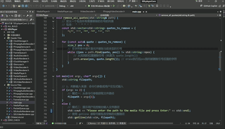

<p align="right">
  <a href="../README.md"><strong>简体中文</strong></a>
</p>

# SDLplayerCore

<p align="center">
  
  
  
  
  
</p>

**A lightweight audio/video player based on C++, FFmpeg, and SDL, designed to help you deeply understand audio/video applications with C++, FFmpeg, and SDL.**


## Table of Contents

- [SDLplayerCore](#sdlplayercore)
  - [Table of Contents](#table-of-contents)
  - [Introduction](#introduction)
  - [Architecture Overview](#architecture-overview)
  - [Current Features](#current-features)
  - [Quick Start](#quick-start)
    - [Prerequisites](#prerequisites)
    - [Compilation and Building](#compilation-and-building)
    - [Project File Structure](#project-file-structure)
  - [How to Use](#how-to-use)
  - [Feedback](#feedback)
  - [License](#license)
  - [Acknowledgements](#acknowledgements)
    - [Core Dependencies](#core-dependencies)
    - [References](#references)
    - [Productivity Tools](#productivity-tools)


## Introduction

`SDLplayerCore` is a lightweight audio and video player developed with C++11, FFmpeg 7, and SDL2, primarily targeting the Windows platform. It supports playing both local media files and streaming media (RTSP, RTMP).

> *Note: The primary goal of this project is for teaching and demonstration purposes, rather than creating a fully-featured daily player to replace mature commercial products like VLC or PotPlayer.*

Performance analysis using the Visual Studio Performance Profiler shows that `SDLplayerCore` maintains a stable CPU usage of **under 3%** when playing 1080P@30fps H.264 videos on a Windows 11 system with a **Ryzen R7-5800H** processor, demonstrating its high efficiency.

The project currently implements the following core functions:

- Data Pipeline - **Buffer Queue** and **Flow Control** design
- Player Core - **Audio-Video Synchronization**
- Event/State Management - **Window Resizing**, **Play/Pause**, etc.
- Streaming Support - *RTSP (TCP / UDP)*, *RTMP*
- Debug Overlay - Clock source, Player state, FPS, etc.

Through this project, developers can learn:

- **FFmpeg 7 API**: Combining `libavformat` for demuxing and `libavcodec` for audio/video decoding.
- **SDL2 API**: Creating windows, rendering video frames (AVFrame -> YUV -> RGB), and handling audio PCM data.
- **Multithreaded Concurrent Programming**: Managing data reading/demuxing, decoding, and rendering modules via independent and safe threads, using modern C++ mutexes and condition variables.
- **Audio-Video Synchronization**: Implementing a basic but effective sync strategy based on `SDL_QueueAudio`.
- **CMake Build System**: Configuring a cross-platform-oriented project with external dependencies.

**Live Demo:**

The image below demonstrates video playback, window resizing, and pause/resume functionality.



## Architecture Overview

This project adopts a classic multi-threaded "Producer-Consumer" architecture, decoupling the playback process into 1 main thread, 5 worker threads and 1 control thread. They exchange data via thread-safe buffer queues.

> **Design Details**
> If you want to learn more about the technical details of `SDLplayerCore` (e.g., A/V sync),
> please refer to the **[Design Document (DESIGN.md)](../docs/DESIGN.md)**.

The basic architecture and data flow diagram of `SDLplayerCore` are shown below:


In this project, we use a finite state machine to organize state transitions, as shown in the following pattern:


> **About the Diagrams**
> <details>
>   <summary>Click to view source files and editing instructions</summary>
> 
> The architecture diagrams and flowcharts in this project are drawn using [Mermaid](https://mermaid.js.org/) and [Draw.io](https://www.drawio.com/).
> 
> The illustrations displayed in the documentation are in `.svg` format. Their corresponding source files (`.drawio` files and some `.md` files containing `mermaid` source code) are stored in the `docs/assets/` directory.
> 
> To modify the diagrams, the recommended workflow is: Edit the `mermaid` source code in the `.md` file, import it into the corresponding `.drawio` source file for adjustment, export as a new `.svg` image, update the image path in the document, and finally commit all related files.
> </details>

## Current Features

- [x] Play mainstream video/audio formats (e.g., MP4, AVI, FLV, MP3, WAV, FLAC, etc.)
- [x] Audio-Video Synchronization
- [x] Play, Pause, and Stop
- [x] Window Resizing
- [x] Streaming Media Playback (RTSP, RTMP)
- [x] Debug Information Overlay

## Quick Start

### Prerequisites

Before compiling and running, ensure your environment meets the following requirements:
- **OS**: Windows 10/11 (64-bit)
- **IDE/Compiler**: Visual Studio 2022 (v17.9+) with "Desktop development with C++" workload.
- **Build System**: CMake (3.15+)
- **Version Control**: Git

### Compilation and Building

1.  **Clone the project**
    ```bash
    git clone https://github.com/Ko-vey/SDLplayerCore.git
    cd SDLplayerCore
    ```

2.  **Install Dependencies**

    This project depends on **FFmpeg 7** and **SDL2**.

    **Method 1: Using vcpkg**

    [vcpkg](https://learn.microsoft.com/en-us/vcpkg/) is an efficient C++ library manager.

    ```bash
    # Install vcpkg (if not installed)
    git clone https://github.com/microsoft/vcpkg.git
    ./vcpkg/bootstrap-vcpkg.bat # Windows

    # Install dependencies (Example for Windows x64)
    # Ensure FFmpeg 7 and SDL2 versions
    vcpkg install ffmpeg:x64-windows sdl2:x64-windows
    ```

    **Method 2: Manual Download & Configuration**

    If you prefer manual management:

    1. **SDL2**
        - Download `SDL2-devel-2.32.2-VC.zip` from the [SDL2 Releases](https://github.com/libsdl-org/SDL/releases/tag/release-2.32.2).
        - Download `SDL2_ttf-devel-2.24.0-VC.zip` from the [SDL_ttf Releases](https://github.com/libsdl-org/SDL_ttf/releases/download/release-2.24.0/).
        - Create a `third_party/sdl2` folder in the project root and organize as follows:
          ```bash
          third_party/sdl2/
          ├── include/SDL2/  (contains all .h files)
          ├── lib/      (contains all .lib/.pdb files)
          └── bin/      (contains all .dll files)
          ```
        > **Note**: The debug overlay requires the `SDL_ttf` plugin. Please ensure that your system has the font file `docs/assets/fonts/arial.ttf` (adjustable in `src/source/SDLVideoRenderer.cpp`. We also provide an alternative file `third_party/fonts/arial.ttf`).

    2. **FFmpeg 7**
        - Download the **shared** version (`libffmpeg_7.0_msvc17_x64.zip`) from [FFmpeg Windows Builds](https://github.com/ShiftMediaProject/FFmpeg/releases/tag/7.0).
        - Create a `third_party/ffmpeg` folder in the project root:
          ```bash
          third_party/ffmpeg/
          ├── include/  (contains libav* headers)
          ├── lib/      (contains .lib files)
          └── bin/      (contains .dll files)
          ```
        > **Note**: Ensure the `find_package` paths in `CMakeLists.txt` match your directory structure.

    3. **Build**
        - **Using vcpkg:**
          ```bash
          cmake -S . -B build -DCMAKE_TOOLCHAIN_FILE=[vcpkg_path]/scripts/buildsystems/vcpkg.cmake
          cmake --build build
          ```

        - **Manual Configuration:**
          ```bash
          cmake -S . -B build
          cmake --build build
          ```

    The executable will be generated in `build/Release`. You can also open `build/SDLplayerCore.sln` in Visual Studio.

### Project File Structure

```bash
SDLplayerCore/
├── .github/              # Github specific configs
├── CHANGELOG.md          # Changelog
├── CMakeLists.txt        # CMake configuration
├── LICENSE               # License file
├── README.md             # Project Guide
├── build/                # Build artifacts
├── docs/                 # Documentation
│   ├── assets/           # Images and assets
│   └── DESIGN.md         # Design details
├── src/                  # Source Code
│   ├── include/          # Headers (.h)
│   │   ├── MediaPlayer.h # Main Class Definition
│   │   └── ...           
│   └── source/           # Implementation (.cpp)
│       ├── MediaPlayer.cpp # Main Class Implementation
│       ├── main.cpp      # Entry point
│       └── ...           
└── third_party/          # (Optional) Manual dependencies
    ├── ffmpeg/           
    └── sdl2/             
```

## How to Use

1. **Run**:

   - Open a terminal (CMD/PowerShell) in the executable directory and run the `.exe`.

     > **Tip**: If you get "Missing DLL" errors, manually copy `.dll` files from `third_party/.../bin/` to the directory where `SDLPlayer.exe` is located.

2. **Provide Media**:

   Enter the full path or URL of the media when prompted, or drag and drop the file into the terminal.

    ```powershell
    # Example
    PS D:\path\to\SDLplayerCore\build\Release> ./SDLPlayer.exe

    Please enter the path to the media file and press Enter:
    D:\Videos\demo.mp4
    ```

   > **Test Files**
   >
   > <details>
   >   <summary>Click for copyright-free test resources</summary>
   >
   > - **Video + Audio:** [Big Buck Bunny](https://peach.blender.org/download/)
   > - **Video Only:** [Jellyfish Bitrate Test Files](https://repo.jellyfin.org/archive/jellyfish/)
   > - **Audio Only:** [Sample MP3](https://file-examples.com/index.php/sample-audio-files/sample-mp3-download/)
   >
   > </details>

3. **Controls**:

   - **Play/Pause**: `Space` key.
   - **Stop**: `ESC` key or close the window.
   - **Resize**: Drag window edges with `Mouse`.

## Feedback

This project is primarily for personal development recording and demonstration. Therefore, I am not actively seeking Pull Requests (PRs) at this time.

However, **communication and feedback** are welcome! If you encounter bugs or have suggestions, please **Create an Issue** on the [Issues Page](https://github.com/Ko-vey/SDLplayerCore/issues). I will check and reply regularly.

## License

This project is licensed under the **LGPLv3 (GNU Lesser General Public License v3.0)**. See [LICENSE](../LICENSE) for details.

**Important**:

- This project depends on **FFmpeg** (LGPL) and **SDL2** (zlib License).
- You must comply with the licenses of this project and all its dependencies.
- According to LGPL, you should link FFmpeg dynamically to allow library replacement.

## Acknowledgements

Sincere thanks to the following projects, tools, and knowledge sharers.

### Core Dependencies

- [**FFmpeg**](https://ffmpeg.org/) - Powerful open-source multimedia framework, the foundation for decoding and demuxing.
- [**SDL2**](https://libsdl.org/) - Excellent cross-platform multimedia library, handling window creation, rendering, and audio.

### References

- **Lei Xiaohua's Blog** - A tribute to Dr. Lei Xiaohua. His [Simplest FFmpeg+SDL Player](https://blog.csdn.net/leixiaohua1020/article/details/38868499) series is the enlightenment tutorial for countless developers in China and the starting point of this project.
- [**ffplay.c**](https://github.com/FFmpeg/FFmpeg/blob/master/fftools/ffplay.c) - The official and authoritative example for learning player core logic like A/V sync.
- [**ijkplayer**](https://github.com/bilibili/ijkplayer) - Bilibili's mobile player, a best practice in the mobile player field.
- [**FFmpeg Tutorial (Zhihu)**](https://zhuanlan.zhihu.com/p/682106665) - An excellent C++ FFmpeg tutorial helping beginners build their first demo quickly.

### Productivity Tools

- **Large Language Models (LLM)** - For their assistance in information retrieval, solution design, coding, and documentation, significantly improving efficiency.
