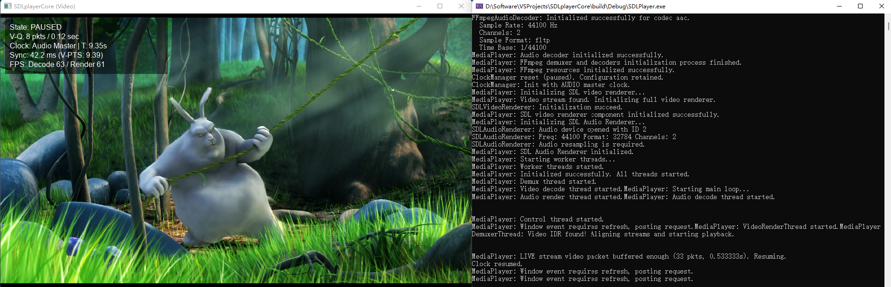
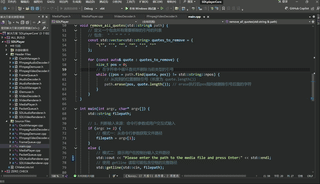

<p align="right">
  <a href=".github/README.md"><strong>English</strong></a>
</p>

# SDLplayerCore

<p align="center">
  
  
  
  
  
  </p>

**一款轻量级的 C++ 音视频播放器核心，助你深入理解 FFmpeg 与 SDL 的多线程应用。**



## 目录

- [SDLplayerCore](#sdlplayercore)
  - [目录](#目录)
  - [项目简介](#项目简介)
  - [架构概览](#架构概览)
  - [已有功能](#已有功能)
  - [快速开始](#快速开始)
    - [环境依赖](#环境依赖)
    - [编译与构建](#编译与构建)
    - [项目文件结构](#项目文件结构)
  - [如何使用](#如何使用)
  - [问题反馈](#问题反馈)
  - [计划功能](#计划功能)
  - [许可证](#许可证)
  - [致谢](#致谢)
    - [核心依赖库](#核心依赖库)
    - [学习与参考资源](#学习与参考资源)
    - [生产力工具](#生产力工具)


## 项目简介

`SDLplayerCore` 是一款基于 C++11、FFmpeg7 和 SDL2 开发的轻量级音视频播放器应用。它主要面向Windows平台，同时也是一个完整的音视频开发实践案例。

> *注意，本项目的主要目标是教学和演示，而不是打造一个功能完备、可以替代VLC或MPC等成熟产品的日常播放器。*

该项目目前实现了:
- 音视频播放中的**缓存队列**和**流量控制**设计

- 核心**音视频同步**

- **播放/暂停**逻辑

- **窗口画面的尺寸调整**功能

开发者可以通过这个项目学习到：

- **FFmpeg7 API**: 如何结合 `libavformat` 库进行解封装，`libavcodec` 库进行音视频解码。

- **SDL2 API**: 如何创建窗口、渲染视频帧（AVFrame -> YUV -> RGB）、以及处理音频PCM数据。

- **多线程并发编程**: 如何通过独立且安全的线程分别管理数据读取与解封装、音视频解码和渲染模块，并通过现代 C++11 的互斥锁和条件变量进行线程间通信。

- **音视频同步**: 基于 `SDL_QueueAudio` 实现一个基础但有效的音视频同步策略。

- **CMake 构建系统**: 配置一个依赖于外部库的、面向跨平台的项目。

**动态演示：**

下图展示了播放器播放视频和纯音频文件、窗口拉伸、暂停/恢复的功能。



## 架构概览

本项目采用多线程“生产者-消费者”模型，将播放流程解耦为5个核心线程，它们之间通过线程安全的缓存队列进行数据交换。

> **关于设计与实现**
> 如果你想要深入了解本播放器的架构、数据流和核心机制（如音视频同步、流量控制等），
> 请参阅 **[设计细节文档 (DESIGN.md)](docs/DESIGN.md)**。

> **关于挑战与解决方案**
> 在开发过程中，我们攻克了一系列复杂且影响项目最终架构的技术难题。我们挑选了其中几个最具代表性的案例，并简要记录了从问题诊断到最终解决的过程，简要展示了本项目在多线程、性能和稳定性方面的实践细节。
> 详情请见 **[开发核心挑战解析文档 (CHALLENGES.md)](docs/CHALLENGES.md)**


> **关于图表**
> <details>
>   <summary>点击查看图表源文件与编辑说明</summary>
> 
> 本项目中的架构图和流程图是使用 [Mermaid](https://mermaid.js.org/) 和 [Draw.io](https://www.drawio.com/) 绘制的。
> 
> 文档内直接展示的插图为 `.svg` 格式，其对应的源文件 (`.drawio` 文件以及部分以 `.md` 格式存储的 `mermaid` 源码) 存放在 `docs/assets/` 目录下。
> 
> 如需修改图表，推荐的流程是：优先编辑 `.md` 文件中的 `mermaid` 源代码，将其导入对应的 `.drawio` 源文件进行调整，然后导出为新的 `.svg` 图片，并更新文档中的图片路径，最后将所有相关文件一并提交。
> </details>

## 已有功能

- [x] 支持主流视频格式播放 (如 MP4, AVI, FLV 等)
- [x] 支持主流音频格式播放 (如 MP3, WAV, FLAC 等)
- [x] 音画同步
- [x] 视频播放、暂停与停止
- [x] 窗口尺寸调整

## 快速开始

### 环境依赖

在编译运行程序前，确保开发环境满足以下要求：

- **操作系统**: Windows 10/11 (64-bit)

- **IDE/编译器**: Visual Studio 2022 (v17.9+)，并已安装 “使用 C++ 的桌面开发” 工作负载。

- **构建系统**: CMake(3.15+)

- **版本控制**: Git

### 编译与构建

1. **克隆项目**
    ```bash
    git clone https://gitee.com/ko-vey/sdlplayer-core.git
    cd SDLplayerCore
    ```

2. **安装依赖项**

    本项目依赖于 **FFmpeg7** 和 **SDL2**。有两种方式来配置它们：

    **方式一：使用 vcpkg**

    [vcpkg](https://learn.microsoft.com/zh-cn/vcpkg/) 是一个高效的 C++ 库管理器，可以简化依赖项的安装过程。

    ```bash
    # (如果尚未安装)安装 vcpkg ...
    git clone https://github.com/microsoft/vcpkg.git
    ./vcpkg/bootstrap-vcpkg.sh # 或者 bootstrap-vcpkg.bat (Windows)

    # 为本项目安装依赖 (以 Windows x64 为例)
    # 确保是 FFmpeg7 和 SDL2 版本
    vcpkg install ffmpeg:x64-windows sdl2:x64-windows
    ```

    **方式二：手动下载与配置**

    如果希望手动管理依赖，请遵循以下步骤。

    1. **SDL2**
        - 从 [SDL2 官方发布页面](https://github.com/libsdl-org/SDL/releases/tag/release-2.32.2) 下载 `SDL2-devel-2.32.2-VC.zip` (适用于 Visual C++)。
        - 在项目根目录下创建 `third_party/sdl2` 文件夹，并将解压后的内容组织如下：
          ```bash
          third_party/sdl2/
          ├── include/SDL2/  (存放所有 .h 文件)
          ├── lib/      (存放所有 .lib/.pdb 文件)
          └── bin/      (存放所有 .dll 文件)
          ```
    2. **FFmpeg 7**
        - 从 [FFmpeg 官网推荐的 Windows Builds](https://github.com/ShiftMediaProject/FFmpeg/releases/tag/7.0) 下载 shared 版本的库 (`libffmpeg_7.0_msvc17_x64.zip`)。
        - 在项目根目录下创建 `third_party/ffmpeg` 文件夹，并将解压后的内容组织如下：
          ```bash
          third_party/ffmpeg/
          ├── include/  (存放 libav* 等头文件)
          ├── lib/      (存放 .lib 文件)
          └── bin/      (存放 .dll 文件)
          ```
        > 注意: 手动配置时，请确保 `CMakeLists.txt` 中的 find_package 路径与目录结构相匹配。

    3. **构建项目**
        - **如果使用 vcpkg:**
          ```bash
          # -DCMAKE_TOOLCHAIN_FILE 指向 vcpkg 的工具链文件
          cmake -S . -B build -DCMAKE_TOOLCHAIN_FILE=[vcpkg_path]/scripts/buildsystems/vcpkg.cmake

          # 编译
          cmake --build build
          ```

        - **如果手动配置依赖:**
          ```bash
          # 在 Developer Command Prompt for VS 2022 等终端中
          # 在项目根目录下
          cmake -S . -B build
          # 编译
          cmake --build build
          ```

    构建完成后，可执行文件将位于 `build/Release` 目录下。也可以使用 Visual Studio 打开 `build/SDLplayerCore.sln` 并进行编译和调试。

### 项目文件结构

在完成基本的准备工作后，项目文件结构大致如下：

```bash
SDLplayerCore/
├── .github/              # Github 平台的相关配置
├── CMakeLists.txt        # CMake 配置文件，定义项目和依赖项
├── README.md             # 项目指南 (本文档)
├── LICENSE               # 许可证文件
├── build/                # (生成) CMake 构建目录，存放中间文件和最终产物
├── docs/                 # 项目文档
│   ├── assets/           # 文档中使用的图片源文件等
│   ├── CHALLENGES.md     # 开发核心挑战解析文档
│   └── DESIGN.md         # 设计细节文档
├── src/                  # 项目源代码
│   ├── include/          # 头文件 (.h)
│   │   ├── MediaPlayer.h # 播放器主类定义
│   │   └── ...           # 其他核心组件的头文件
│   └── source/           # 源文件 (.cpp)
│       ├── MediaPlayer.cpp # 播放器主类实现
│       ├── main.cpp      # 程序入口，处理用户输入和窗口事件
│       └── ...           # 其他核心组件的实现
└── third_party/          # (可选) 用于手动存放第三方依赖库
    ├── ffmpeg/           # FFmpeg 库文件
    └── sdl2/             # SDL2 库文件
```

## 如何使用

1. **运行程序**:
   - 将 `FFmpeg` 和 `SDL2` 的 `.dll` 文件（位于 `third_party/.../bin/`）复制到可执行文件 `SDLPlayer.exe` 所在的目录（例如 `build/Release/`）。
   - 打开命令行工具 (如 CMD 或 PowerShell)，进入该目录，运行程序。

2. **提供媒体文件**:

    程序启动后会提示输入文件路径。你可以输入或将媒体文件的完整路径拖入窗口，然后按回车键。

    ```powershell
    # 示例
    PS D:\path\to\SDLplayerCore\build\Release> ./SDLPlayer.exe

    Please enter the path to the media file and press Enter:
    D:\Videos\demo.mp4
    ```

    > **关于测试文件**
    > <details>
    >   <summary>点击这里获取无版权的标准测试资源</summary>
    > 
    >   你可以使用电脑上的任何音视频文件进行测试。如果需要，这里有一些常用的、无版权问题的标准测试资源可供下载：
    >
    > - **视频:**
    >    - [**Big Buck Bunny (1080p, MP4)**](https://test-videos.co.uk/vids/bigbuckbunny/mp4/h264/1080/Big_Buck_Bunny_1080_10s_1MB.mp4)
    > - **音频:**
    >    - [**Sample MP3 File**](https://file-examples.com/index.php/sample-audio-files/sample-mp3-download/)
    >    - [**Sample WAV File**](https://file-examples.com/index.php/sample-audio-files/sample-wav-download/)
    >
    >   下载后，将文件保存在你的电脑上，并在程序中输入其完整路径。
    > </details>

3. **播放控制**:
   - **播放/暂停**: 按下 `空格键`。
   - **停止播放**: 按下 `ESC键` 或者 `关闭播放器窗口` 。
   - **调整窗口**: 使用 `鼠标` 拖动窗口边缘，视频画面将自适应缩放。

## 问题反馈

本项目主要作为个人的学习记录与技术展示。因此，目前不主动寻求代码贡献（PR, Pull Requests）。

但是，非常欢迎任何形式的**交流与反馈**！如果你在使用中遇到任何问题、发现了 Bug，或者对项目设计有任何建议和想法，请通过 **创建 Issue** 联系：在本项目的 [Issues 页面](../../../issues) 提交你的问题或建议。我会定期查看并回复。

感谢你的关注与理解！

## 计划功能

各项计划功能的优先度顺序如下:

- **交互控制**
  - [ ] 简易UI及音量调节 (考虑使用 `ImGui`, 实现进度条、控制按钮)
  - [ ] 进度跳转 (Seek)
- **丰富功能**
  - [ ] 字幕渲染 (如 `.srt`, `.ass`)
  - [ ] 网络流支持 (如 `RTSP`, `HLS`)
- **性能与算法优化**
  - [ ] 硬件加速 (考虑使用 `Direct3D 11`)
  - [ ] 变速播放 (考虑使用 `FFmpeg` 的 `avfilter`)
  - [ ] 动态时钟同步

## 许可证

本项目采用 **LGPLv3 (GNU Lesser General Public License v3.0)** 许可。完整的许可证文本请参见 [LICENSE](LICENSE) 文件。

**重要提示**:
- 本项目依赖于 **FFmpeg** (通常基于 LGPL) 和 **SDL2** (基于 zlib License)。
- 当您使用、修改或分发本软件时，必须同时遵守本项目许可证以及其所有依赖项的许可证规定。
- 根据 LGPL 的要求，您应当以**动态链接**的方式使用 FFmpeg 库，以允许用户替换该库。

## 致谢

这个项目得以实现，离不开以下优秀项目、高效工具和无私分享的知识。在此向它们表示诚挚感谢。

### 核心依赖库

- [**FFmpeg**](https://ffmpeg.org/) - 强大的开源多媒体处理框架，是本项目中音视频解码、解封装等核心功能的基础。

- [**SDL2 (Simple DirectMedia Layer)**](https://libsdl.org/) - 优秀的跨平台多媒体开发库，负责本项目中的窗口创建、视频渲染和音频播放等工作。

### 学习与参考资源

- **雷霄骅（雷神）的音视频技术博客** - 在此向英年早逝的国内音视频技术领路人雷霄骅博士表示崇高致敬。他的[《最简单的基于FFMPEG+SDL的视频播放器 ver2 （采用SDL2.0）》](https://blog.csdn.net/leixiaohua1020/article/details/38868499)及其系列文章是国内无数音视频开发者入门的启蒙教程，也是本项目的起点。

- [**ffplay.c 源码**](https://github.com/FFmpeg/FFmpeg/blob/master/fftools/ffplay.c) - FFmpeg官方提供的播放器实现，它是学习音画同步、多线程处理等播放器核心逻辑的最权威且最经典的范例。

- [**FFmpeg开发入门教程 (知乎)**](https://zhuanlan.zhihu.com/p/682106665) - 一个出色的 C++ FFmpeg 开发入门教程，尤其适合对FFmpeg API不熟悉的初学者，可以帮助理解音视频概念、并快速搭建运行第一个demo。

### 生产力工具
- 本项目的顺利完成，还得益于开发流程中对各类 **大型语言模型 (LLM, Large Language Model)** 辅助工具的整合与应用。它们在本项目的信息检索、方案设计、代码实现、文档撰写等多个环节中，提供了无数指引和帮助，极大提升了本项目的开发效率和质量。
