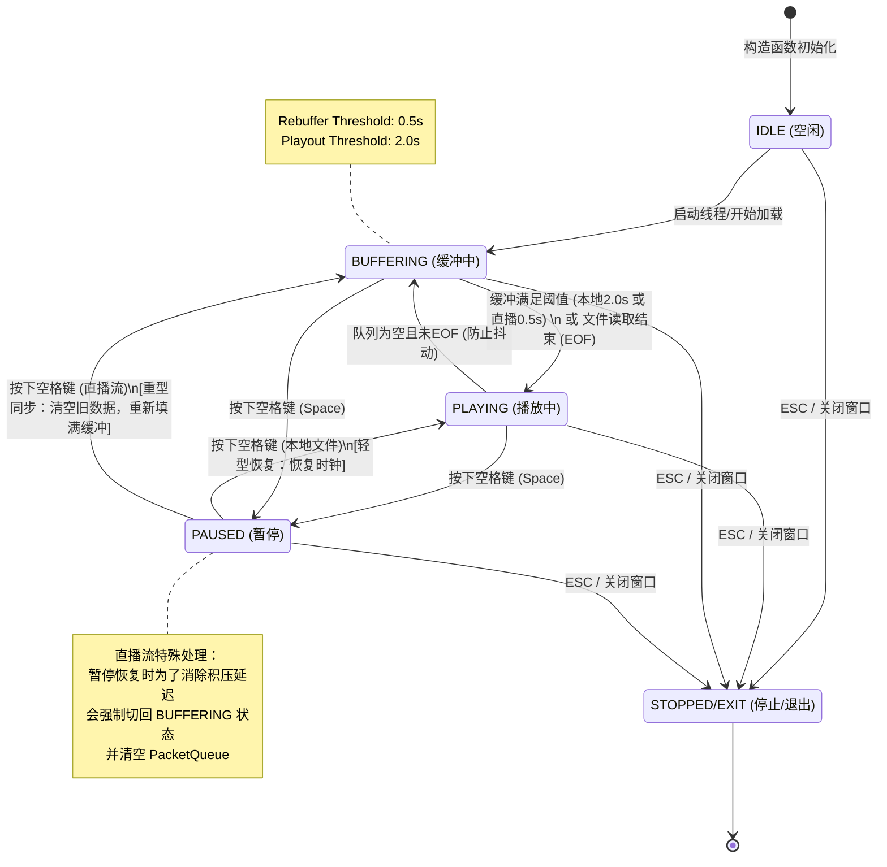

```mermaid
stateDiagram-v2
    [*] --> IDLE: 构造函数初始化

    state "IDLE (空闲)" as IDLE
    state "BUFFERING (缓冲中)" as BUFFERING
    state "PLAYING (播放中)" as PLAYING
    state "PAUSED (暂停)" as PAUSED
    state "STOPPED/EXIT (停止/退出)" as STOPPED

    %% 初始化过程
    IDLE --> BUFFERING: 启动线程/开始加载

    %% 控制线程逻辑 (自动)
    BUFFERING --> PLAYING: 缓冲满足阈值 (本地2.0s 或 直播0.5s) \n 或 文件读取结束 (EOF)
    PLAYING --> BUFFERING: 队列为空且未EOF (防止抖动)

    %% 用户交互逻辑 (handle_event)
    PLAYING --> PAUSED: 按下空格键 (Space)
    BUFFERING --> PAUSED: 按下空格键 (Space)

    %% 暂停恢复逻辑 - 修复了这里的冒号问题
    PAUSED --> PLAYING: 按下空格键 (本地文件)\n[轻型恢复：恢复时钟]
    PAUSED --> BUFFERING: 按下空格键 (直播流)\n[重型同步：清空旧数据，重新填满缓冲]

    %% 退出逻辑
    IDLE --> STOPPED: ESC / 关闭窗口
    PLAYING --> STOPPED: ESC / 关闭窗口
    BUFFERING --> STOPPED: ESC / 关闭窗口
    PAUSED --> STOPPED: ESC / 关闭窗口
    STOPPED --> [*]

    note right of PAUSED
        直播流特殊处理：
        暂停恢复时为了消除积压延迟
        会强制切回 BUFFERING 状态
        并清空 PacketQueue
    end note

    note left of BUFFERING
        Rebuffer Threshold: 0.5s
        Playout Threshold: 2.0s
    end note
```