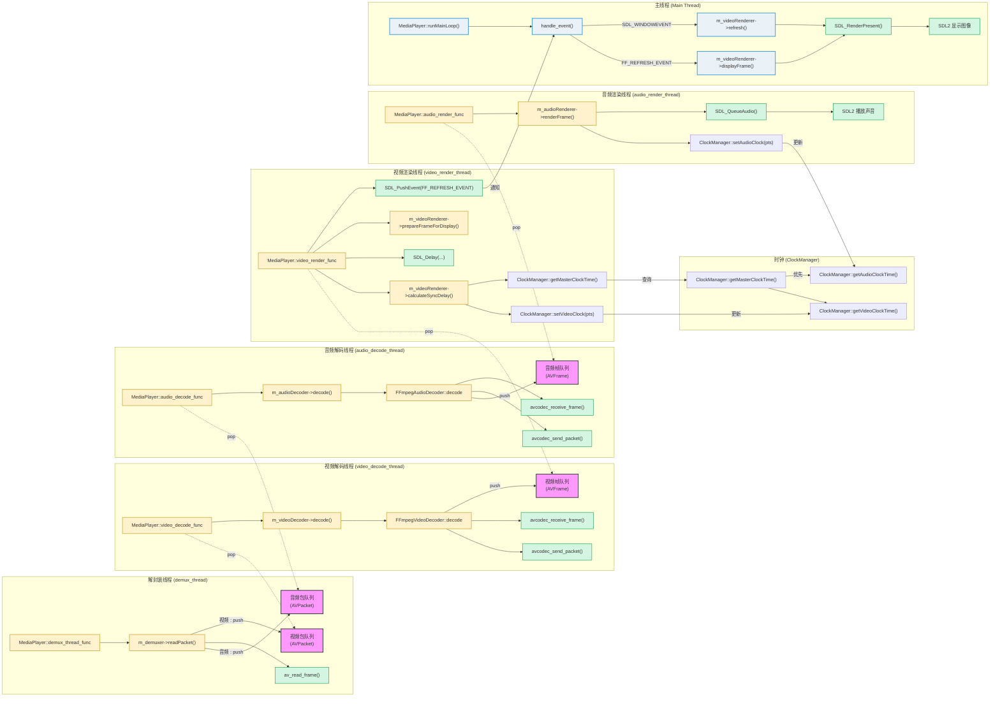

# 总体流程-主图

```mermaid
graph LR
    %% 1. 样式定义
    classDef threadFunc fill:#fff2cc,stroke:#d6b656,stroke-width:2px;
    classDef queue shape:cylinder,fill:#f9f,stroke:#333,stroke-width:2px;
    classDef api fill:#d5f5e3,stroke:#27ae60,stroke-width:1.5px,shape:stadium;
    classDef mainThread fill:#eaf2f8,stroke:#3498db,stroke-width:2px;

    %% 2. 初始化流程
    %% 见另表

    %% 3. 解封装线程
    subgraph "解封装线程  (demux_thread)"
        direction TB
        DemuxThreadFunc[MediaPlayer::demux_thread_func]:::threadFunc
        DemuxThreadFunc --> m_demuxer_read["m_demuxer->readPacket()"]:::threadFunc
        m_demuxer_read -->|音频 : push| AudioPktQueue["音频包队列<br/>(AVPacket)"]:::queue
        m_demuxer_read --> AV_Read_Frame["av_read_frame()"]:::api
        m_demuxer_read -->|视频 : push| VideoPktQueue["视频包队列<br/>(AVPacket)"]:::queue
    end

    %% 4. 视频解码线程
    subgraph "视频解码线程 (video_decode_thread)"
        direction TB
        VideoDecodeFunc[MediaPlayer::video_decode_func]:::threadFunc
        VideoDecodeFunc -.pop.-> VideoPktQueue
        VideoDecodeFunc --> VideoDecoder_Decode["m_videoDecoder->decode()"]:::threadFunc
        VideoDecoder_Decode --> FFmpegVideoDecode[FFmpegVideoDecoder::decode]:::threadFunc
        FFmpegVideoDecode --> SendPacket_V["avcodec_send_packet()"]:::api
        FFmpegVideoDecode --> RecvFrame_V["avcodec_receive_frame()"]:::api
        FFmpegVideoDecode -->|push| VideoFrameQueue["视频帧队列<br/>(AVFrame)"]:::queue
    end

    %% 5. 音频解码线程
    subgraph "音频解码线程 (audio_decode_thread)"
        direction TB
        AudioDecodeFunc[MediaPlayer::audio_decode_func]:::threadFunc
        AudioDecodeFunc -.pop.-> AudioPktQueue
        AudioDecodeFunc --> AudioDecoder_Decode["m_audioDecoder->decode()"]:::threadFunc
        AudioDecoder_Decode --> FFmpegAudioDecode[FFmpegAudioDecoder::decode]:::threadFunc
        FFmpegAudioDecode -->|push| AudioFrameQueue["音频帧队列<br/>(AVFrame)"]:::queue
        FFmpegAudioDecode --> SendPacket_A["avcodec_send_packet()"]:::api
        FFmpegAudioDecode --> RecvFrame_A["avcodec_receive_frame()"]:::api
    end

    %% 6. 视频渲染线程
    subgraph "视频渲染线程 (video_render_thread)"
        direction TB
        VideoRenderFunc[MediaPlayer::video_render_func]:::threadFunc
        VideoRenderFunc -.pop.-> VideoFrameQueue
        VideoRenderFunc --> CalculateDelay["m_videoRenderer->calculateSyncDelay()"]:::threadFunc
        CalculateDelay --> SetVideoClock
        CalculateDelay --> ClockGet["ClockManager::getMasterClockTime()"]
        VideoRenderFunc --> SDLDelay["SDL_Delay(...)"]:::api
        VideoRenderFunc --> PrepareFrame["m_videoRenderer->prepareFrameForDisplay()"]:::threadFunc
        VideoRenderFunc --> PushEvent["SDL_PushEvent(FF_REFRESH_EVENT)"]:::api
    end

    %% 7. 音频渲染线程
    subgraph "音频渲染线程 (audio_render_thread)"
        direction TB
        AudioRenderFunc[MediaPlayer::audio_render_func]:::threadFunc
        AudioRenderFunc -.pop.-> AudioFrameQueue
        AudioRenderFunc --> AudioRenderFrame["m_audioRenderer->renderFrame()"]:::threadFunc
        AudioRenderFrame --> SetAudioClock["ClockManager::setAudioClock(pts)"]
        AudioRenderFrame --> SDLQueue["SDL_QueueAudio()"]:::api
        SDLQueue --> PlaySound[SDL2 播放声音]:::api
    end

    %% 8. 主线程
    subgraph "主线程 (Main Thread)"
        direction TB
        MainLoop["MediaPlayer::runMainLoop()"]:::mainThread
        MainLoop --> HandleEvent["handle_event()"]:::mainThread
        HandleEvent -->|FF_REFRESH_EVENT| DisplayFrame["m_videoRenderer->displayFrame()"]:::mainThread
        HandleEvent -->|SDL_WINDOWEVENT| Refresh["m_videoRenderer->refresh()"]:::mainThread
        DisplayFrame --> SDLPresent["SDL_RenderPresent()"]:::api
        Refresh --> SDLPresent
        SDLPresent --> DisplayImg[SDL2 显示图像]:::api
    end

    %% 9. 时钟模块
    subgraph "时钟 (ClockManager)"
        direction TB
        MasterClock["ClockManager::getMasterClockTime()"]
        AudioClock["ClockManager::getAudioClockTime()"]
        SetVideoClock["ClockManager::setVideoClock(pts)"]
        VideoClock["ClockManager::getVideoClockTime()"]
        MasterClock --> VideoClock
        MasterClock -->|优先| AudioClock
    end

    %% 10. 跨线程/模块连接
    ClockGet -->|查询| MasterClock
    SetAudioClock -->|更新| AudioClock
    SetVideoClock --> |更新| VideoClock
    PushEvent -->|通知| HandleEvent

```
