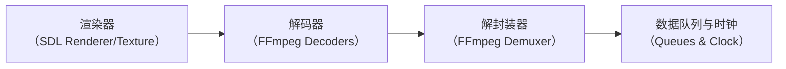

# 释放资源的顺序-示意流程图-从依赖链底部逆流而上

```mermaid
graph LR
    A[渲染器<br>（SDL Renderer/Texture）] --> B[解码器<br>（FFmpeg Decoders）]
    B --> C[解封装器<br>（FFmpeg Demuxer）]
    C --> D[数据队列与时钟<br>（Queues & Clock）]
```
