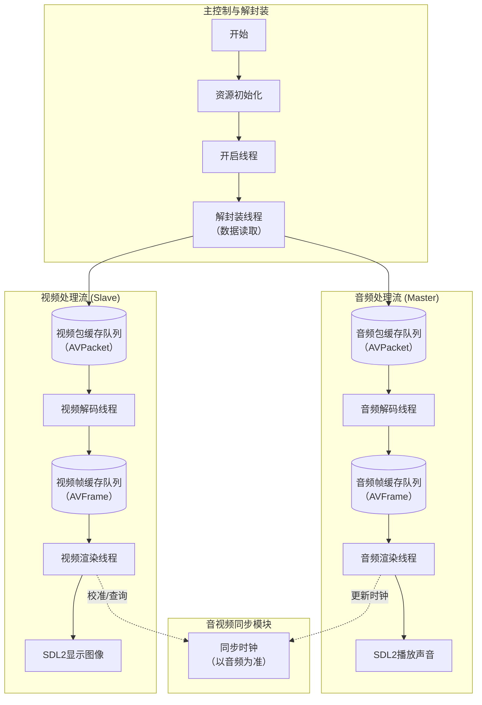

# 核心模块与数据流图

```mermaid
graph TD
    subgraph "主控制与解封装"
        A[开始] --> B[资源初始化]
        B --> C[开启线程]
        C --> D[解封装线程 <br/>（数据读取）]
    end

    D --> VPacketQueue@{ shape: cyl, label: "视频包缓存队列<br/>（AVPacket）"}
    D --> APacketQueue@{ shape: cyl, label: "音频包缓存队列<br/>（AVPacket）"}

    subgraph "视频处理流 (Slave)"
        VPacketQueue --> VDecode[视频解码线程]
        VDecode --> VFrameQueue@{ shape: cyl, label: "视频帧缓存队列<br/>（AVFrame）"}
        VFrameQueue --> VRender[视频渲染线程]
        VRender --> SDL_Video[SDL2显示图像]
    end
    
    subgraph "音视频同步模块"
        Clock[同步时钟<br/>（以音频为准）]
    end

    subgraph "音频处理流 (Master)"
        APacketQueue --> ADecode[音频解码线程]
        ADecode --> AFrameQueue@{ shape: cyl, label: "音频帧缓存队列<br/>（AVFrame）"}
        AFrameQueue --> ARender[音频渲染线程]
        ARender --> SDL_Audio[SDL2播放声音]
    end

    ARender -.更新时钟.-> Clock
    VRender -.校准/查询.-> Clock
```
