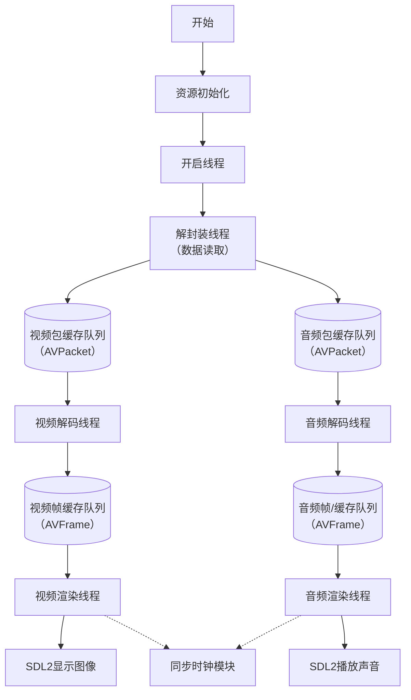

```mermaid
graph TD
    A[开始] --> B[资源初始化]
    B --> C[开启线程]
    C --> D[解封装线程 <br/>（数据读取）]

    D --> VPacketQueue@{ shape: cyl, label: "视频包缓存队列<br/>（AVPacket）"}
    D --> APacketQueue@{ shape: cyl, label: "音频包缓存队列<br/>（AVPacket）"}

    VPacketQueue --> VDecode[视频解码线程]
    VDecode --> VFrameQueue@{ shape: cyl, label: "视频帧缓存队列<br/>（AVFrame）"}
    VFrameQueue --> VRender[视频渲染线程]
    VRender --> SDL_Video[SDL2显示图像]

    Clock[同步时钟模块]

    APacketQueue --> ADecode[音频解码线程]
    ADecode --> AFrameQueue@{ shape: cyl, label: "音频帧/缓存队列<br/>（AVFrame）"}
    AFrameQueue --> ARender[音频渲染线程]
    ARender --> SDL_Audio[SDL2播放声音]

    VRender -.-> Clock
    ARender -.-> Clock
```
