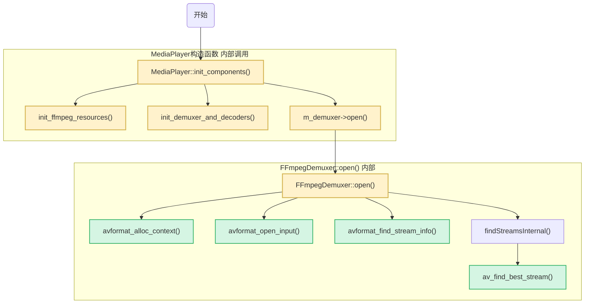

# 初始化流程-小图

```mermaid
graph TD
    classDef api      fill:#d5f5e3,stroke:#27ae60,stroke-width:1.5px,shape:stadium
    classDef threadFunc fill:#fff2cc,stroke:#d6b656,stroke-width:2px

    Start(开始) --> MediaPlayer_Init["MediaPlayer::init_components()"]:::threadFunc

    subgraph "MediaPlayer构造函数 内部调用"
        direction TB
        MediaPlayer_Init --> Init_FF["init_ffmpeg_resources()"]:::threadFunc
        MediaPlayer_Init --> Init_Demux["init_demuxer_and_decoders()"]:::threadFunc
        MediaPlayer_Init --> Demuxer_Open_Call["m_demuxer->open()"]:::threadFunc
    end

    %% FFmpegDemuxer::open 细节
    Demuxer_Open_Call --> FFmpegDemuxer_Open["FFmpegDemuxer::open()"]:::threadFunc
    subgraph "FFmpegDemuxer::open() 内部"
        direction TB
        FFmpegDemuxer_Open --> AllocCtx["avformat_alloc_context()"]:::api
        FFmpegDemuxer_Open --> OpenInput["avformat_open_input()"]:::api
        FFmpegDemuxer_Open --> FindInfo["avformat_find_stream_info()"]:::api
        FFmpegDemuxer_Open --> FindStreamsInternal["findStreamsInternal()"]
        FindStreamsInternal --> BestStream["av_find_best_stream()"]:::api
    end
```
