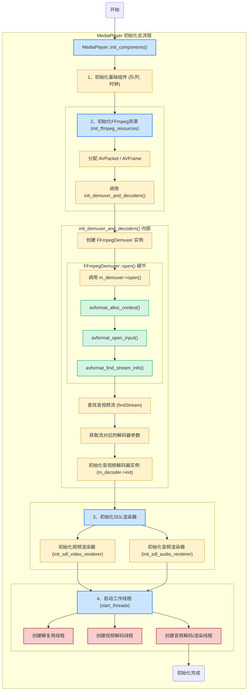

# 初始化流程-小图

```mermaid
graph TD
    %% 定义样式
    classDef mainFunc fill:#cce5ff,stroke:#3385ff,stroke-width:2px,shape:rect
    classDef subFunc  fill:#fff2cc,stroke:#d6b656,stroke-width:1.5px,shape:rounded-rect
    classDef api      fill:#d5f5e3,stroke:#27ae60,stroke-width:1.5px,shape:stadium
    classDef thread   fill:#f8cecc,stroke:#b85450,stroke-width:2px,shape:parallelogram

    %% 流程开始
    Start(开始) --> InitComponents["MediaPlayer::init_components()"]:::mainFunc

    subgraph "MediaPlayer 初始化总流程"
        direction TB

        %% 步骤 1: 初始化C++基础组件
        InitComponents --> Step1["1、初始化基础组件 (队列, 时钟)"]:::subFunc

        %% 步骤 2: 初始化FFmpeg
        Step1 --> InitFFmpeg["2、初始化FFmpeg资源 (init_ffmpeg_resources)"]:::mainFunc
        subgraph " "
            InitFFmpeg --> AllocPacketsFrames["分配 AVPacket / AVFrame"]:::subFunc
            AllocPacketsFrames --> InitDemuxAndDecoders["调用 init_demuxer_and_decoders()"]:::subFunc
        end

        %% 步骤 2.1: 解复用器和解码器初始化细节
        subgraph "init_demuxer_and_decoders() 内部"
            direction TB
            InitDemuxAndDecoders --> CreateDemuxer["创建 FFmpegDemuxer 实例"]:::subFunc
            CreateDemuxer --> DemuxerOpenCall["调用 m_demuxer->open()"]:::subFunc

            %% open() 函数的内部FFmpeg API调用
            subgraph "FFmpegDemuxer::open() 细节"
                direction TB
                DemuxerOpenCall --> AllocCtx["avformat_alloc_context()"]:::api
                AllocCtx --> OpenInput["avformat_open_input()"]:::api
                OpenInput --> FindInfo["avformat_find_stream_info()"]:::api
            end

            %% open() 成功后的逻辑
            FindInfo --> FindStreams["查找音视频流 (findStream)"]:::subFunc
            FindStreams --> GetParams["获取流对应的解码器参数"]:::subFunc
            GetParams --> InitDecoders["初始化音视频解码器实例 (m_decoder->init)"]:::subFunc
        end

        %% 步骤 3: 初始化SDL
        InitDecoders --> InitSDL["3、初始化SDL渲染器"]:::mainFunc
        subgraph " "
            direction TB
            InitSDL --> InitVideoRenderer["初始化视频渲染器 (init_sdl_video_renderer)"]:::subFunc
            InitSDL --> InitAudioRenderer["初始化音频渲染器 (init_sdl_audio_renderer)"]:::subFunc
        end

        %% 步骤 4: 启动线程
        InitVideoRenderer --> StartThreads
        InitAudioRenderer --> StartThreads
        StartThreads["4、启动工作线程 (start_threads)"]:::mainFunc
        subgraph " "
            direction TB
            StartThreads --> CreateDemuxThread["创建解复用线程"]:::thread
            StartThreads --> CreateVideoDecodeThread["创建视频解码线程"]:::thread
            StartThreads --> CreateAudioThreads["创建音频解码/渲染线程"]:::thread
        end
        
        %% 结束
        CreateAudioThreads --> End(初始化完成)
    end
```
