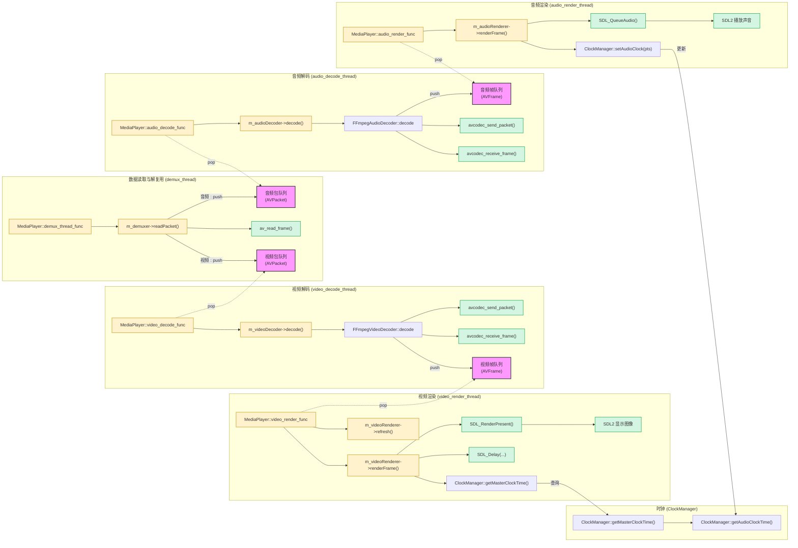

# 总体流程-主图

```mermaid
graph LR
    %% 1. 样式定义
    classDef threadFunc fill:#fff2cc,stroke:#d6b656,stroke-width:2px;
    classDef queue shape:cylinder,fill:#f9f,stroke:#333,stroke-width:2px;
    classDef api fill:#d5f5e3,stroke:#27ae60,stroke-width:1.5px,shape:stadium;

    %% 2. 初始化流程
    %% 见另表

    %% 3. 数据读取 / 解复用线程
    subgraph "数据读取与解复用  (demux_thread)"
        direction TB
        DemuxThreadFunc[MediaPlayer::demux_thread_func]:::threadFunc
        DemuxThreadFunc --> m_demuxer_read["m_demuxer->readPacket()"]:::threadFunc
        m_demuxer_read -->|音频 : push| AudioPktQueue["音频包队列<br/>(AVPacket)"]:::queue
        m_demuxer_read --> AV_Read_Frame["av_read_frame()"]:::api
        m_demuxer_read -->|视频 : push| VideoPktQueue["视频包队列<br/>(AVPacket)"]:::queue
    end

    %% 4. 视频解码线程
    subgraph "视频解码 (video_decode_thread)"
        direction TB
        VideoDecodeFunc[MediaPlayer::video_decode_func]:::threadFunc
        VideoDecodeFunc -.pop.-> VideoPktQueue
        VideoDecodeFunc --> VideoDecoder_Decode["m_videoDecoder->decode()"]:::threadFunc
        VideoDecoder_Decode --> FFmpegVideoDecode[FFmpegVideoDecoder::decode]
        FFmpegVideoDecode --> SendPacket_V["avcodec_send_packet()"]:::api
        FFmpegVideoDecode --> RecvFrame_V["avcodec_receive_frame()"]:::api
        FFmpegVideoDecode -->|push| VideoFrameQueue["视频帧队列<br/>(AVFrame)"]:::queue
    end

    %% 5. 音频解码线程
    subgraph "音频解码 (audio_decode_thread)"
        direction TB
        AudioDecodeFunc[MediaPlayer::audio_decode_func]:::threadFunc
        AudioDecodeFunc -.pop.-> AudioPktQueue
        AudioDecodeFunc --> AudioDecoder_Decode["m_audioDecoder->decode()"]:::threadFunc
        AudioDecoder_Decode --> FFmpegAudioDecode[FFmpegAudioDecoder::decode]
        FFmpegAudioDecode -->|push| AudioFrameQueue["音频帧队列<br/>(AVFrame)"]:::queue
        FFmpegAudioDecode --> SendPacket_A["avcodec_send_packet()"]:::api
        FFmpegAudioDecode --> RecvFrame_A["avcodec_receive_frame()"]:::api
    end

    %% 6. 视频渲染线程
    subgraph "视频渲染 (video_render_thread)"
        direction TB
        VideoRenderFunc[MediaPlayer::video_render_func]:::threadFunc
        VideoRenderFunc -.pop.-> VideoFrameQueue
        VideoRenderFunc --> RenderFrame["m_videoRenderer->renderFrame()"]:::threadFunc
        RenderFrame --> ClockGet["ClockManager::getMasterClockTime()"]
        RenderFrame --> SDLDelay["SDL_Delay(...)"]:::api
        RenderFrame --> SDLPresent["SDL_RenderPresent()"]:::api
        VideoRenderFunc --> Refresh["m_videoRenderer->refresh()"]:::threadFunc
        SDLPresent --> DisplayImg[SDL2 显示图像]:::api
    end

    %% 7. 音频渲染线程
    subgraph "音频渲染 (audio_render_thread)"
        direction TB
        AudioRenderFunc[MediaPlayer::audio_render_func]:::threadFunc
        AudioRenderFunc -.pop.-> AudioFrameQueue
        AudioRenderFunc --> AudioRenderFrame["m_audioRenderer->renderFrame()"]:::threadFunc
        AudioRenderFrame --> SetAudioClock["ClockManager::setAudioClock(pts)"]
        AudioRenderFrame --> SDLQueue["SDL_QueueAudio()"]:::api
        SDLQueue --> PlaySound[SDL2 播放声音]:::api
    end

    %% 8. 时钟模块
    subgraph "时钟 (ClockManager)"
        direction TB
        MasterClock["ClockManager::getMasterClockTime()"]
        AudioClock["ClockManager::getAudioClockTime()"]
        MasterClock --> AudioClock
    end

    %% 9. 线程‑时钟连接
    ClockGet -->|查询| MasterClock
    SetAudioClock -->|更新| AudioClock
```
