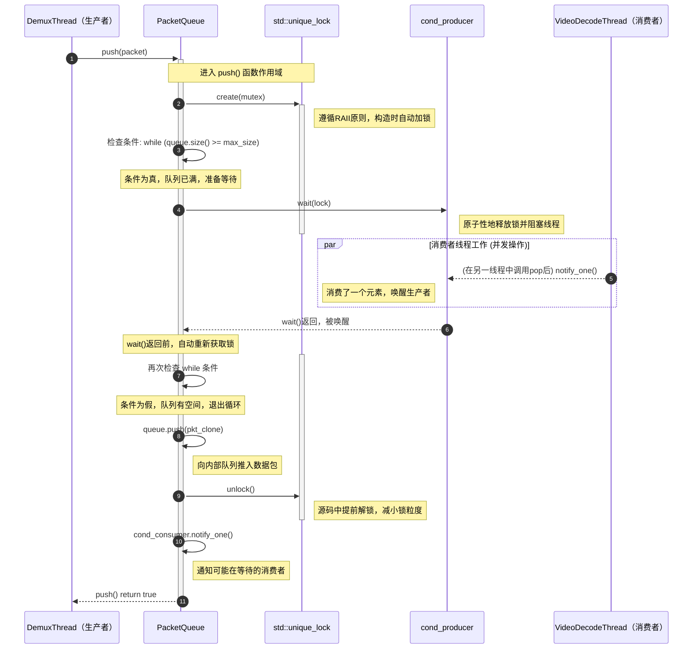

# 缓存队列对生产者的阻塞-示意图

```mermaid
sequenceDiagram
    autonumber
    participant Producer as DemuxThread（生产者）
    participant Queue as PacketQueue
    participant Lock as std::unique_lock
    participant CondProducer as cond_producer

    Producer->>+Queue: push(packet)

    note over Queue, Lock: 进入 push() 函数作用域
    Queue->>+Lock: create(mutex)
    note right of Lock: 遵循RAII原则，构造时自动加锁

    Queue->>Queue: 检查条件: while (queue.size() >= max_size)
    note over Queue: 条件为真，队列已满，准备等待

    Queue->>CondProducer: wait(lock)
    note right of CondProducer: 原子性地释放锁并阻塞线程
    deactivate Lock

    par 消费者线程工作 (并发操作)
        participant Consumer as VideoDecodeThread（消费者）
        Consumer-->>CondProducer: (在另一线程中调用pop后) notify_one()
        note left of CondProducer: 消费了一个元素，唤醒生产者
    end

    CondProducer-->>Queue: wait()返回，被唤醒
    note over Queue: wait()返回前，自动重新获取锁
    activate Lock

    Queue->>Queue: 再次检查 while 条件
    note over Queue: 条件为假，队列有空间，退出循环

    Queue->>Queue: queue.push(pkt_clone)
    note right of Queue: 向内部队列推入数据包

    Queue->>Lock: unlock()
    note right of Lock: 源码中提前解锁，减小锁粒度
    deactivate Lock

    Queue->>Queue: cond_consumer.notify_one()
    note right of Queue: 通知可能在等待的消费者

    Queue-->>-Producer: push() return true
```
