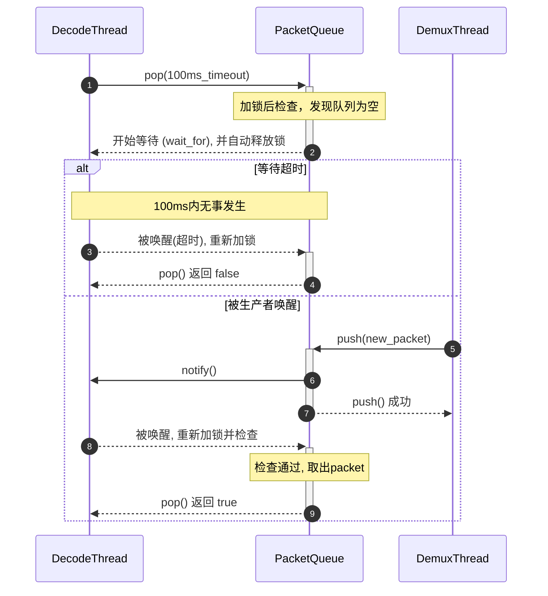

# 缓存队列对消费者的阻塞-示意图

```mermaid
sequenceDiagram
    autonumber
    participant Consumer as DecodeThread
    participant Queue as PacketQueue
    participant Producer as DemuxThread

    Consumer->>+Queue: pop(100ms_timeout)
    note over Queue: 加锁后检查，发现队列为空

    Queue-->>-Consumer: 开始等待 (wait_for), 并自动释放锁

    alt 等待超时
        note over Consumer, Queue: 100ms内无事发生
        Consumer-->>+Queue: 被唤醒(超时), 重新加锁
        Queue-->>-Consumer: pop() 返回 false

    else 被生产者唤醒
        % 生产者放入数据
        Producer->>+Queue: push(new_packet)
        % 通知消费者有新货了
        Queue->>Consumer: notify()
        Queue-->>-Producer: push() 成功

        Consumer-->>+Queue: 被唤醒, 重新加锁并检查
        note over Queue: 检查通过, 取出packet
        Queue-->>-Consumer: pop() 返回 true
    end
```
