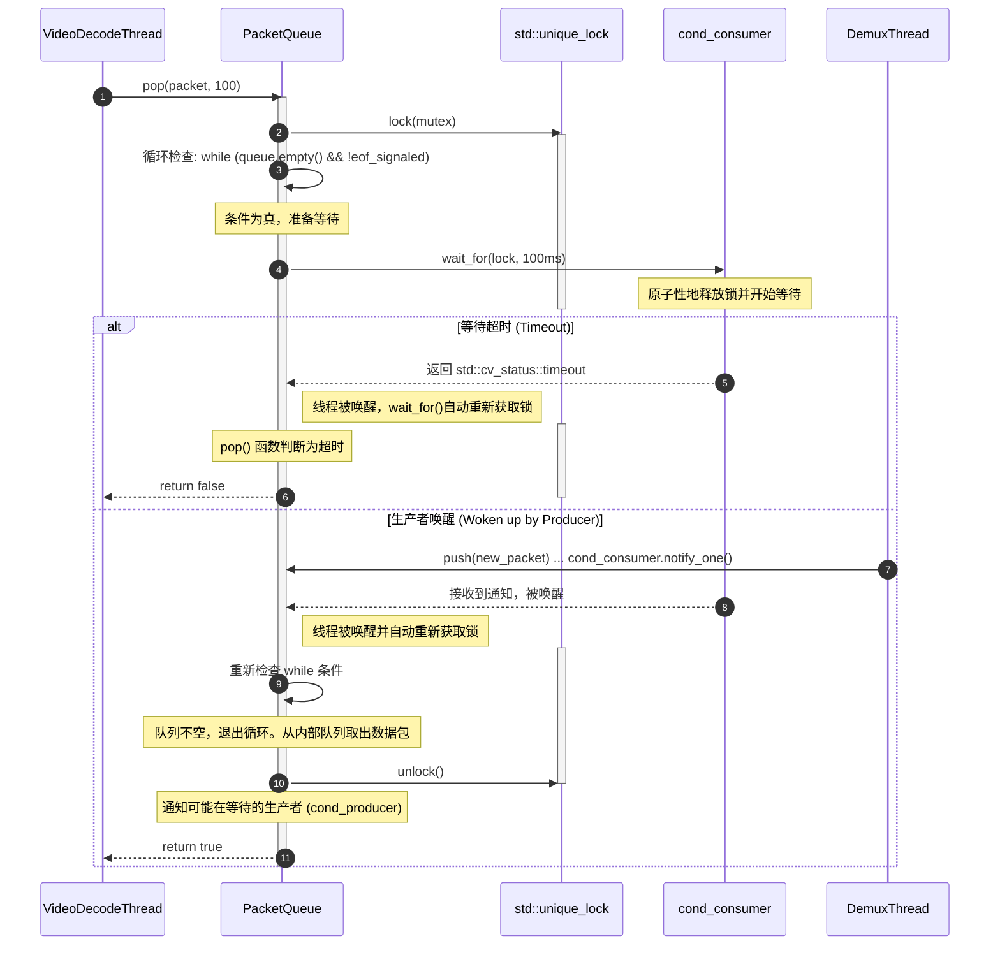

# 缓存队列对消费者的阻塞-示意图

```mermaid
sequenceDiagram
    autonumber
    participant Consumer as VideoDecodeThread
    participant Queue as PacketQueue
    participant Lock as std::unique_lock
    participant Condition as cond_consumer

    Consumer->>Queue: pop(packet, 100)
    activate Queue
    Queue->>Lock: lock(mutex)
    activate Lock
    Queue->>Queue: 循环检查: while (queue.empty() && !eof_signaled)
    note over Queue: 条件为真，准备等待
    Queue->>Condition: wait_for(lock, 100ms)
    note over Condition: 原子性地释放锁并开始等待
    deactivate Lock

    alt 等待超时 (Timeout)
        Condition-->>Queue: 返回 std::cv_status::timeout
        note right of Queue: 线程被唤醒，wait_for()自动重新获取锁
        activate Lock
        note over Queue: pop() 函数判断为超时
        Queue-->>Consumer: return false
        deactivate Lock

    else 生产者唤醒 (Woken up by Producer)
        participant Producer as DemuxThread
        Producer->>Queue: push(new_packet) ... cond_consumer.notify_one()
        Condition-->>Queue: 接收到通知，被唤醒
        note right of Queue: 线程被唤醒并自动重新获取锁
        activate Lock
        Queue->>Queue: 重新检查 while 条件
        note over Queue:  队列不空，退出循环。从内部队列取出数据包
        Queue->>Lock: unlock()
        deactivate Lock
        note over Queue: 通知可能在等待的生产者 (cond_producer)
        Queue-->>Consumer: return true
    end

    deactivate Queue

```
