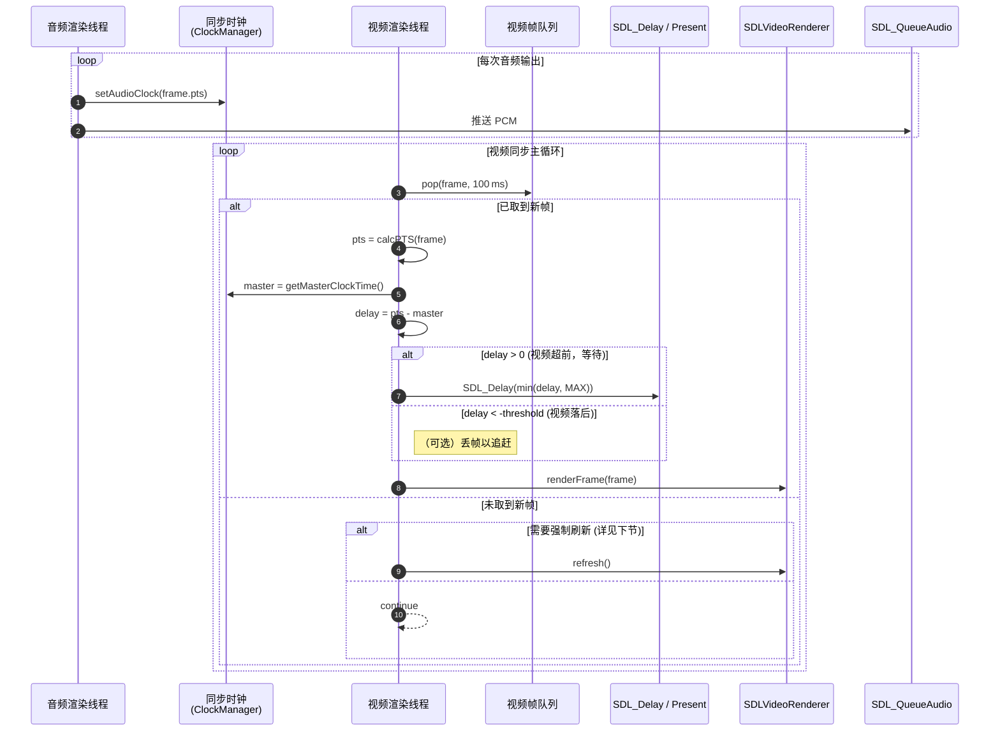

# 音画同步机制的线程交互图

```mermaid
sequenceDiagram
    autonumber
    participant AudioRenderThread as 音频渲染线程
    participant Clock as 同步时钟<br/>(ClockManager)
    participant VideoRenderThread as 视频渲染线程
    participant VideoFrameQueue as 视频帧队列
    participant SDL as SDL_Delay / Present
    participant VideoRenderer as SDLVideoRenderer

    loop 每次音频输出
        AudioRenderThread ->> Clock: setAudioClock(frame.pts)
        AudioRenderThread ->> SDL_QueueAudio : 推送 PCM
    end

    loop 视频同步主循环
        VideoRenderThread ->> VideoFrameQueue: pop(frame, 100 ms)
        alt 已取到新帧
            VideoRenderThread ->> VideoRenderThread: pts = calcPTS(frame)
            VideoRenderThread ->> Clock: master = getMasterClockTime()
            VideoRenderThread ->> VideoRenderThread: delay = pts - master
            alt delay > 0 (视频超前，等待)
                VideoRenderThread ->> SDL: SDL_Delay(min(delay, MAX))
            else delay < -threshold (视频落后)
                Note right of VideoRenderThread: （可选）丢帧以追赶
            end
            VideoRenderThread ->> VideoRenderer: renderFrame(frame)
        else 未取到新帧
            alt 需要强制刷新 (详见下节)
                VideoRenderThread ->> VideoRenderer: refresh()
            else
                VideoRenderThread -->> VideoRenderThread: continue
            end
        end
    end
```
