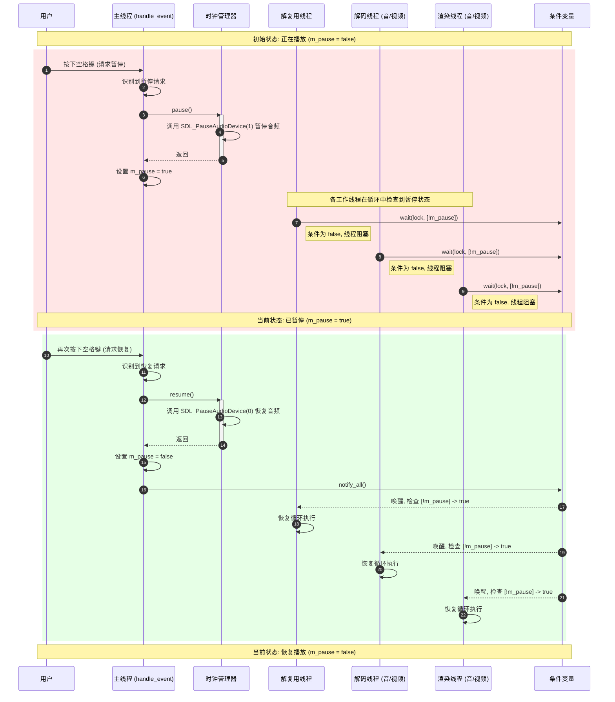

# 暂停播放机制-线程交互图

```mermaid
sequenceDiagram
    autonumber
    participant User as 用户
    participant MainThread as 主线程 (handle_event)
    participant ClockManager as 时钟管理器
    participant DemuxThread as 解复用线程
    participant DecodeThreads as 解码线程 (音/视频)
    participant RenderThreads as 渲染线程 (音/视频)
    participant m_pause_cond as 条件变量

    Note over User, m_pause_cond: 初始状态: 正在播放 (m_pause = false)

    %% === 场景一：从播放到暂停 ===
    rect rgb(255, 230, 230)

    User->>MainThread: 按下空格键 (请求暂停)
    MainThread->>MainThread: 识别到暂停请求
    MainThread->>ClockManager: pause()
    activate ClockManager
    ClockManager->>ClockManager: 调用 SDL_PauseAudioDevice(1) 暂停音频
    ClockManager-->>MainThread: 返回
    deactivate ClockManager
    MainThread->>MainThread: 设置 m_pause = true

    Note over DemuxThread, RenderThreads: 各工作线程在循环中检查到暂停状态
    DemuxThread->>m_pause_cond: wait(lock, [!m_pause])
    Note right of DemuxThread: 条件为 false, 线程阻塞
    DecodeThreads->>m_pause_cond: wait(lock, [!m_pause])
    Note right of DecodeThreads: 条件为 false, 线程阻塞
    RenderThreads->>m_pause_cond: wait(lock, [!m_pause])
    Note right of RenderThreads: 条件为 false, 线程阻塞

    Note over User, m_pause_cond: 当前状态: 已暂停 (m_pause = true)

    end

    %% === 场景二：从暂停到恢复播放 ====
    
    rect rgb(230, 255, 230)

    User->>MainThread: 再次按下空格键 (请求恢复)
    MainThread->>MainThread: 识别到恢复请求
    MainThread->>ClockManager: resume()
    activate ClockManager
    ClockManager->>ClockManager: 调用 SDL_PauseAudioDevice(0) 恢复音频
    ClockManager-->>MainThread: 返回
    deactivate ClockManager
    MainThread->>MainThread: 设置 m_pause = false
    MainThread->>m_pause_cond: notify_all()

    m_pause_cond-->>DemuxThread: 唤醒, 检查 [!m_pause] -> true
    DemuxThread->>DemuxThread: 恢复循环执行
    m_pause_cond-->>DecodeThreads: 唤醒, 检查 [!m_pause] -> true
    DecodeThreads->>DecodeThreads: 恢复循环执行
    m_pause_cond-->>RenderThreads: 唤醒, 检查 [!m_pause] -> true
    RenderThreads->>RenderThreads: 恢复循环执行

    end

    Note over User, m_pause_cond: 当前状态: 恢复播放 (m_pause = false)
```
