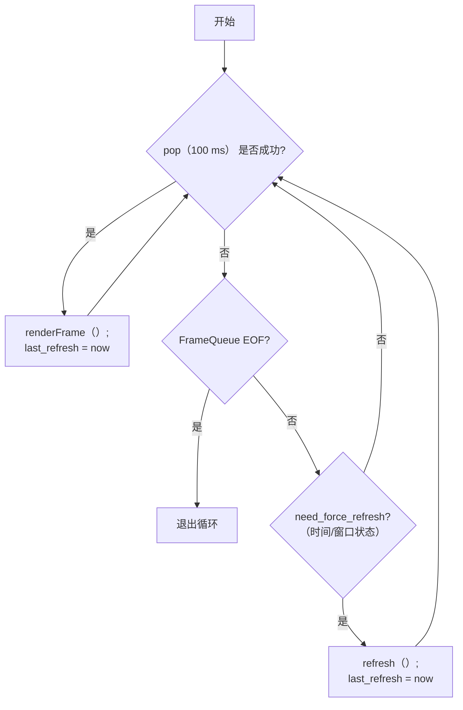

# 视频渲染线程自主刷新机制-流程图

```mermaid
flowchart TD
    A[开始] --> B{pop（100 ms） 是否成功?}
    B -- 是 --> C[renderFrame（）; <br/>last_refresh = now]
    C --> B
    B -- 否 --> D{FrameQueue EOF?}
    D -- 是 --> E[退出循环]
    D -- 否 --> F{need_force_refresh?<br/>（时间/窗口状态）}
    F -- 是 --> G[refresh（）; <br/>last_refresh = now]
    G --> B
    F -- 否 --> B
```
