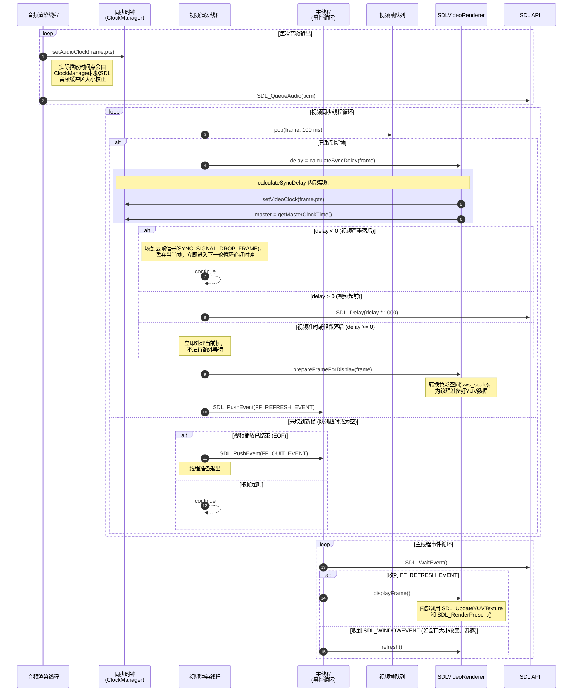

# 音画同步机制的线程交互图

```mermaid
sequenceDiagram
    autonumber
    
    participant AudioRenderThread as 音频渲染线程
    participant Clock as 同步时钟<br>(ClockManager)
    participant VideoRenderThread as 视频渲染线程
    participant MainThread as 主线程<br>(事件循环)
    participant VideoFrameQueue as 视频帧队列
    participant VideoRenderer as SDLVideoRenderer
    participant SDL as SDL API

    loop 每次音频输出
        AudioRenderThread ->> Clock: setAudioClock(frame.pts)
        note right of AudioRenderThread: 实际播放时间点会由<br>ClockManager根据SDL<br>音频缓冲区大小校正
        AudioRenderThread ->> SDL: SDL_QueueAudio(pcm)
    end

    loop 视频同步线程循环
        VideoRenderThread ->> VideoFrameQueue: pop(frame, 100 ms)
        alt 已取到新帧
            VideoRenderThread ->> VideoRenderer: delay = calculateSyncDelay(frame)
            rect rgb(230, 230, 255)
                note over VideoRenderer, Clock: calculateSyncDelay 内部实现
                VideoRenderer ->> Clock: setVideoClock(frame.pts)
                VideoRenderer ->> Clock: master = getMasterClockTime()
            end
            
            alt delay < 0 (视频严重落后)
                Note over VideoRenderThread: 收到丢帧信号(SYNC_SIGNAL_DROP_FRAME)，<br>丢弃当前帧，立即进入下一轮循环追赶时钟
                VideoRenderThread -->> VideoRenderThread: continue
            else delay > 0 (视频超前)
                VideoRenderThread ->> SDL: SDL_Delay(delay * 1000)
            else 视频准时或轻微落后 (delay >= 0)
                Note over VideoRenderThread: 立即处理当前帧，<br>不进行额外等待
            end

            VideoRenderThread ->> VideoRenderer: prepareFrameForDisplay(frame)
            note over VideoRenderer: 转换色彩空间(sws_scale)，<br>为纹理准备好YUV数据
            
            VideoRenderThread ->> MainThread: SDL_PushEvent(FF_REFRESH_EVENT)
        else 未取到新帧 (队列超时或为空)
            alt 视频播放已结束 (EOF)
                 VideoRenderThread ->> MainThread: SDL_PushEvent(FF_QUIT_EVENT)
                 note over VideoRenderThread: 线程准备退出
            else 取帧超时
                 VideoRenderThread -->> VideoRenderThread: continue
            end
        end
    end

    loop 主线程事件循环
        MainThread ->> SDL: SDL_WaitEvent()
        alt 收到 FF_REFRESH_EVENT
            MainThread ->> VideoRenderer: displayFrame()
            note over VideoRenderer: 内部调用 SDL_UpdateYUVTexture<br>和 SDL_RenderPresent()
        else 收到 SDL_WINDOWEVENT (如窗口大小改变、暴露)
            MainThread ->> VideoRenderer: refresh()
        end
    end

```
