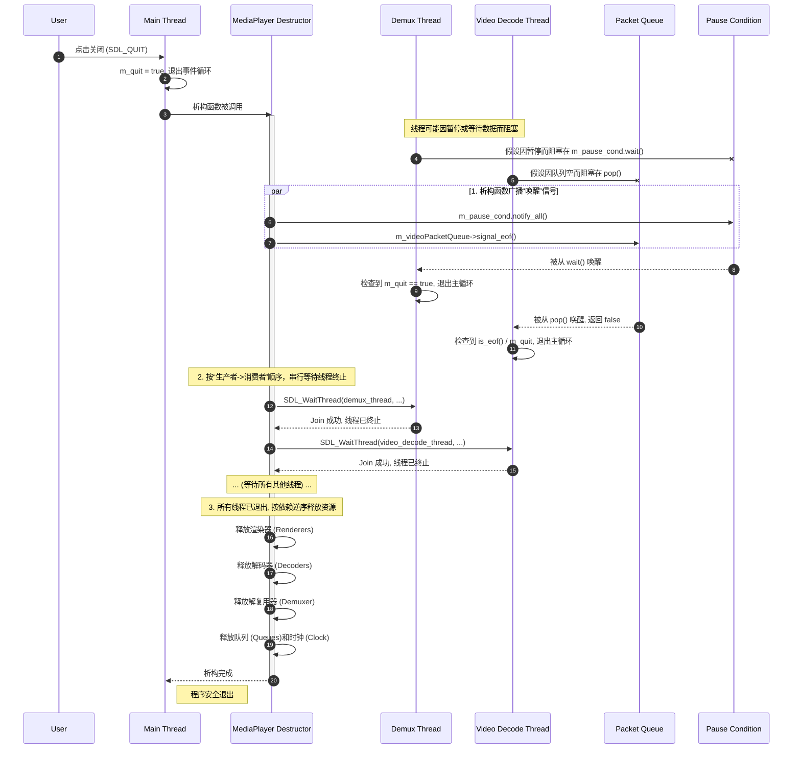

# 优雅退出机制-线程交互图

```mermaid
sequenceDiagram
    autonumber
    participant User
    participant MainThread as Main Thread
    participant Dtor as MediaPlayer Destructor
    participant Demux as Demux Thread
    participant Decode as Video Decode Thread
    participant PQueue as Packet Queue
    participant PCond as Pause Condition

    User->>MainThread: 点击关闭 (SDL_QUIT)
    MainThread->>MainThread: m_quit = true, 退出事件循环
    MainThread->>Dtor: 析构函数被调用
    activate Dtor

    Note over Demux, Decode: 线程可能因暂停或等待数据而阻塞
    Demux-xPCond: 假设因暂停而阻塞在 m_pause_cond.wait()
    Decode-xPQueue: 假设因队列空而阻塞在 pop()

    par 1. 析构函数广播“唤醒”信号
        Dtor->>PCond: m_pause_cond.notify_all()
        Dtor->>PQueue: m_videoPacketQueue->signal_eof()
    end

    PCond-->>Demux: 被从 wait() 唤醒
    Demux->>Demux: 检查到 m_quit == true, 退出主循环
    
    PQueue-->>Decode: 被从 pop() 唤醒, 返回 false
    Decode->>Decode: 检查到 is_eof() / m_quit, 退出主循环

    Note over Dtor: 2. 按“生产者->消费者”顺序，串行等待线程终止
    Dtor->>Demux: SDL_WaitThread(demux_thread, ...)
    Demux-->>Dtor: Join 成功, 线程已终止
    
    Dtor->>Decode: SDL_WaitThread(video_decode_thread, ...)
    Decode-->>Dtor: Join 成功, 线程已终止

    Note over Dtor: ... (等待所有其他线程) ...

    Note over Dtor: 3. 所有线程已退出, 按依赖逆序释放资源
    Dtor->>Dtor: 释放渲染器 (Renderers)
    Dtor->>Dtor: 释放解码器 (Decoders)
    Dtor->>Dtor: 释放解复用器 (Demuxer)
    Dtor->>Dtor: 释放队列 (Queues)和时钟 (Clock)

    Dtor-->>MainThread: 析构完成
    deactivate Dtor
    
    note right of MainThread: 程序安全退出
```
