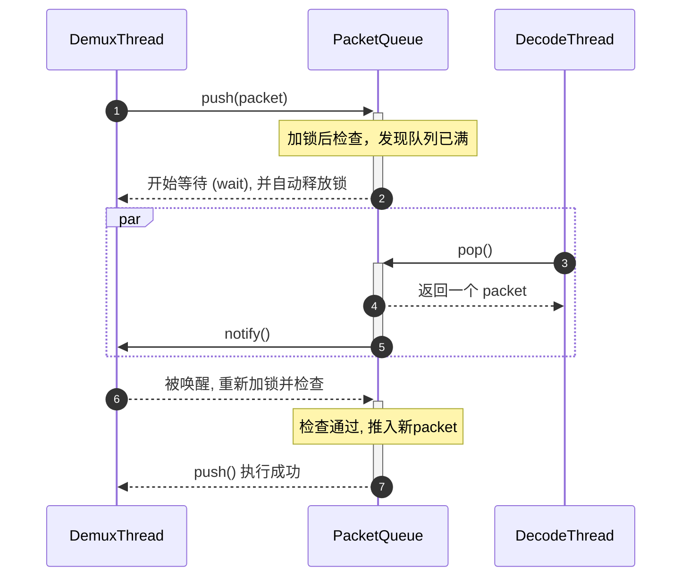

# 缓存队列对生产者的阻塞-示意图

```mermaid
sequenceDiagram
    autonumber
    participant Producer as DemuxThread
    participant Queue as PacketQueue
    participant Consumer as DecodeThread

    Producer->>+Queue: push(packet)
    note over Queue: 加锁后检查，发现队列已满

    Queue-->>-Producer: 开始等待 (wait), 并自动释放锁

    par
        % 正常消费
        Consumer->>+Queue: pop()
        Queue-->>Consumer: 返回一个 packet
        % 通知生产者有空位了
        Queue->>-Producer: notify()
    end

    Producer-->>+Queue: 被唤醒, 重新加锁并检查
    note over Queue: 检查通过, 推入新packet

    Queue-->>-Producer: push() 执行成功
```
